# The SP Quadcopter System

This is the source code and hardware design for a quadcopter system that was developed at SP Technical Research Institute of Sweden in the department of electronics as a demonstrator within the EU Projects KARYON and PROWESS.

Figure 1 shows an overview of the quadcopter system and how everything is connected.

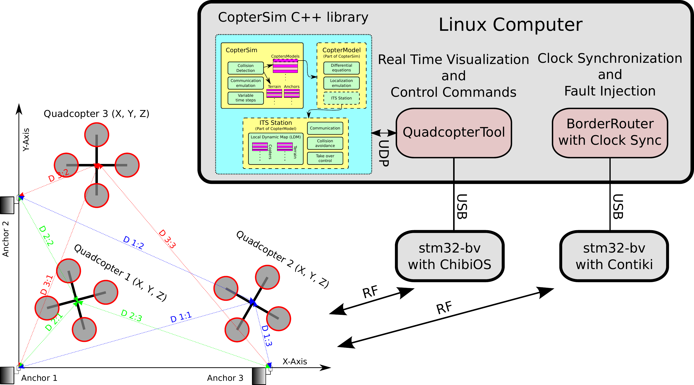

The system consists of:

* Quadcopters
	- We have used up to 4 quadcopters simultaneously.
	
* [Anchors](#anchors)
	- For localization in GNSS-denied areas.
	- 2, 3 or 4 anchors can be used. When 4 anchors are used, the system can still operate if at least one of them or at most two of them fail due to redundancy.
	
* A Linux computer with two [stm32-bv motes](http://vedder.se/2013/04/cc2520-and-stm32-rf-boards/).
	- [QuadcopterTool](#quadcoptertool) is used for real time display and sending control commands to the quadcopters.
	- A border router is used to synchronize the clocks of all quadcopters and [anchors](#anchors) to microsecond level for ultrasound localization and TDMA communication.

* A [simulator](#coptersim) for the quadcopter system
	- The quadcopters and the localization system are simulated.
	- Can send the state of the simulation over UDP to [QuadcopterTool](#quadcoptertool) for visualization.
	- Cooperative collision avoidance is implemented in the simulator.

The following parts are included with this repository:

* **Embedded** - software running on the microcontrollers of the quadcopter system.
	- **border_router_clock_sync** - A contiki border router that also sends out clock synchronization packets (running on *stm32-bv with Contiki* in the next Figure).
	- **QuadcopterMain** - Main control software for the quadcopters (running on the *Mainboard*).
	- **Range** - Software for the *Ranging Board* and the anchors.
	- **Receiver** - Running on *stm32-bv with ChibiOS* in the next Figure and on a modified remote controller.
	- **Lib** - ChibiOS and Contiki
* **Linux** - software running on a GNU/Linux distribution (e.g. Ubuntu) for configuration, control and simulation.
	- **CopterSim** - A [simulation library](#coptersim) for the quadcopter system.
	- **CopterSimGui** - Graphical user interface for the [CopterSim](#coptersim) library
	- **FaultCheck** - Fault Injection Library used in [CopterSim](#coptersim) and [CopterSimGui](#coptersimgui)
	- **magnetometer_calibration** - Octave scripts for soft and hard iron compensation on the magnetometer.
	- **QuadcopterTool** - Graphical user interface for control and real time visualization of the quadcopter platform.
	- *build* - Script for building everything.
	- *clean* - Script for removing all built files.
	- *set_env* - Script used by the other scripts for setting the required environment variables.
	- *start_QuadcopterTool* - Script for starting [QuadcopterTool](#quadcoptertool).
	- *start_sim* - Script for starting [CopterSimGui](#coptersimgui) (that uses [CopterSim](#coptersim) and FaultCheck) and [QuadcopterTool](#quadcoptertool) for visualizing the simulation.
* **Hardware** - hardware design files
	- **MainBoard** - Design files files for the MainBoard and Ranging Board PCBs
* **Documentation**
	- **Figures** - The figures in the documentation.
	- **Figures_pdf_png** - Png versions of all PDF files for including them in markdown
	- **PDF** - The documentation rendered as PDF files.
	- *conv_png* - Script for converting all PDF figures to PNG images.
* *build_doc* - Script for generating PDF files of the documentation.

A tutorial on how to get everything running can be found [here](Tutorial.md) (or [here](Tutorial.pdf) as pdf).

## Hardware on each Quadcopter

The hardware architecture on each quadcopter is shown in Figure 2.

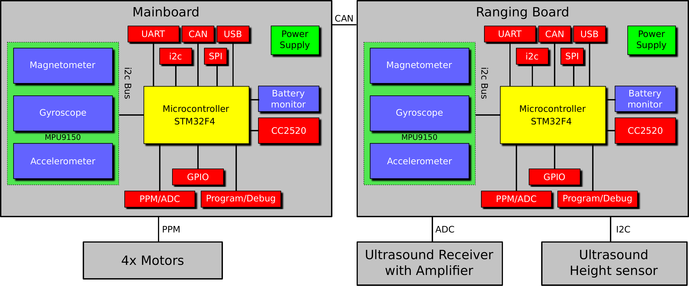

Each quadcopter has two custom hardware-wise identical computing nodes connected over CAN-bus. The schematic and hardware layout, as well as the source code, for these computing nodes is included with this repository.

The Mainboard uses the [ChibiOS 3.x](http://www.chibios.org) RTOS, and runs the attitude control loop, position estimation, position control and interfaces with [QuadcopterTool](#quadcoptertool) over its radio link. The motors are connected to the Mainboard. More details about the software on the Mainboard can be found in the section [Mainboard Software](#mainboard-software).

The Ranging Board (RB) runs a [custom port](http://vedder.se/2013/10/a-contiki-port-for-my-custom-cc2520stm32f4-boards/) of [Contiki OS](http://www.contiki-os.org/) and is responsible for localization. The RB has a synchronized clock with the [anchors](#anchors) (provided by the border router) and measures the distance to them using the Time of Flight of ultrasound pulses sent from the anchors. In order to reject noise, the pulses are modulated using the sinc function and identified using cross correlation on sampled signal on the RB. An ultrasound height sensor is also connected to the RB that measures the distance from the quadcopter to the ground. All measured distances and the synchronized clock are sent over CAN-bus to the Mainboard for processing. Notice that the quadcopters can be controller manually without connecting the ranging board if desired.

A photo of the Main Board is shown in Figure 3.

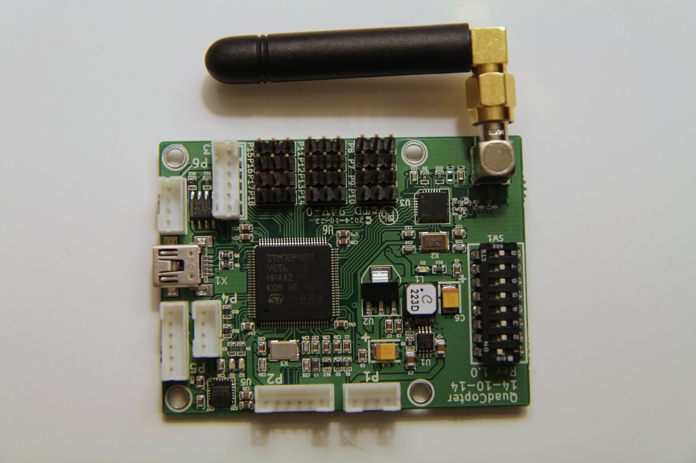

## Mainboard Software
The important software on the MainBoard consists of the following parts:

**actuator**  
Translates throttle, roll, pitch and yaw output to commands for the motors. Compensation for varying input is also applied here.

**broadcast**  
Broadcast status and safety messages to the other quadcopters and to [QuadcopterTool](#quadcoptertool). The status message, used by [QuadcopterTool](#quadcoptertool), contains:

* Quadcopter ID
* Firmware Version
* Position (X, Y, Z)
* Attitude (roll, pitch, yaw)
* Velocity (vx, vy)
* Battery voltage
* Voltages sampled on the ADC port

The safety message (which will not be covered in detail in this description yet) contains:

* Quadcopter ID
* Local level of service
* Global level of service

To not get interference, these messages are sent out using TDMA based on the quad ID and the global clock provided by the ranging board.

**control**  
The attitude control loop.

**mpu9150** and **MahonyAHRS**  
Reading and processing of the accelerometer, gyroscope and magnetometer signals to calculate the filtered attitude of the quadcopter.

**navigation**  
The position control loop.

**pos**  
Position estimation based on the quadcopter attitude, [anchor](#anchors) readings and the motor power output (which for now is assumed to be 1g vertical acceleration).

**safety**  
Level of service calculation of the quadcopter (local) and all quadcopters (global).

**packet_handler**  
The communication protocol between QuadcopterTool and the quadcopters.

**Makefile**  
A makefile for building the software on the mainboard.

## QuadcopterTool

QuadcopterTool is a GUI to visualize and send commands to the quadcopter system. The main control page is shown in Figure 4. There are several pages for control, configuration and visualization, and the lower part of QuadcopterTool shows which quadcopters are sent status messages the past second together with their firmware version and battery level.

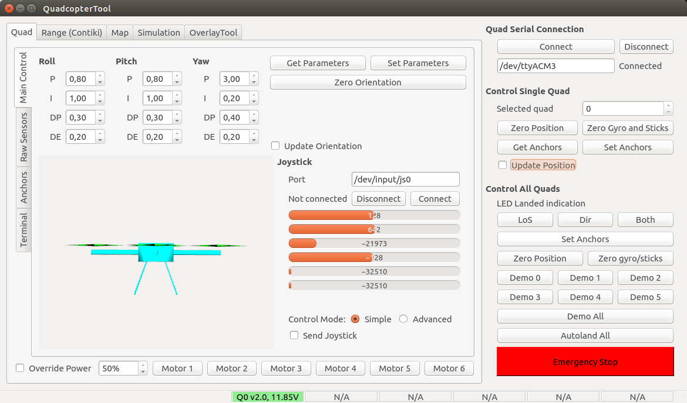

Figure 5 shows how the raw accelerometer, gyroscope and magnetometer values are plotted in real time in QuadcopterTool.

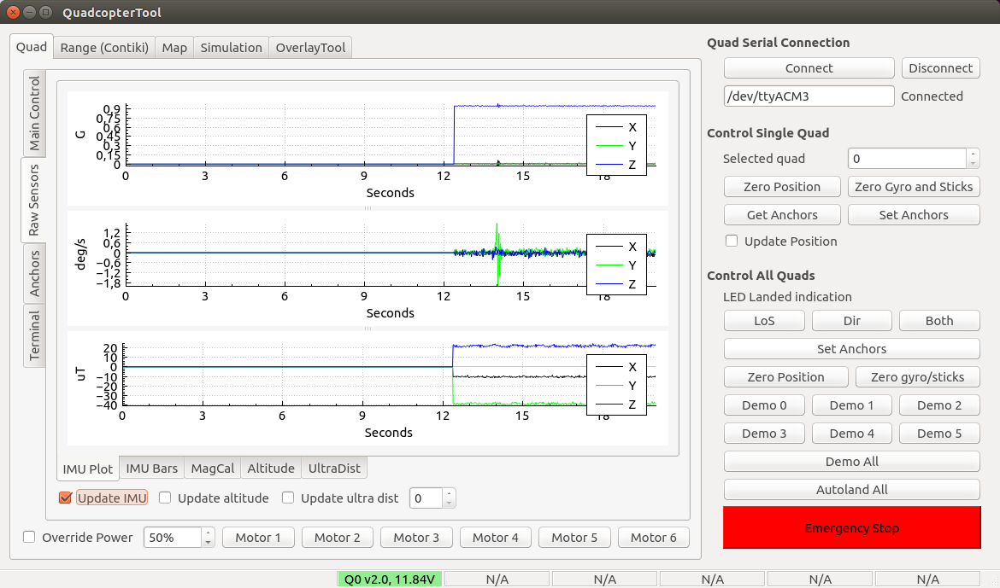

Figure 6 shows how one quadcopter is displayed on a map in real time in QuadcopterTool. 4 [anchors](#anchors) are also shown and a red bounding box where the quadcopter is allowed to fly. The [anchor](#anchors) positions and the bounding box can be edited and uploaded to the quadcopters from QuadcopterTool for the localization to work.

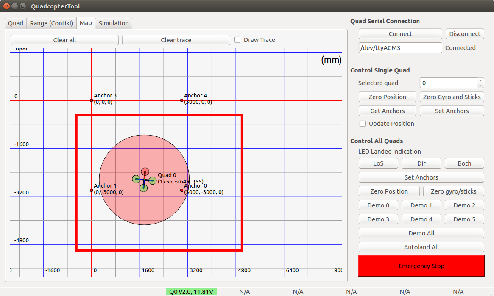

## Anchors

The quadcopter system uses anchors that send ultrasound pulses to the quadcopters for measuring the distance to them. This is done based on the time of flight of the ultrasound pulses which can be measured by having a synchronized clock between the quadcopters and anchors. This system is used for localization in GNSS-denied areas. A photo of the anchors is shown in Figure 7.

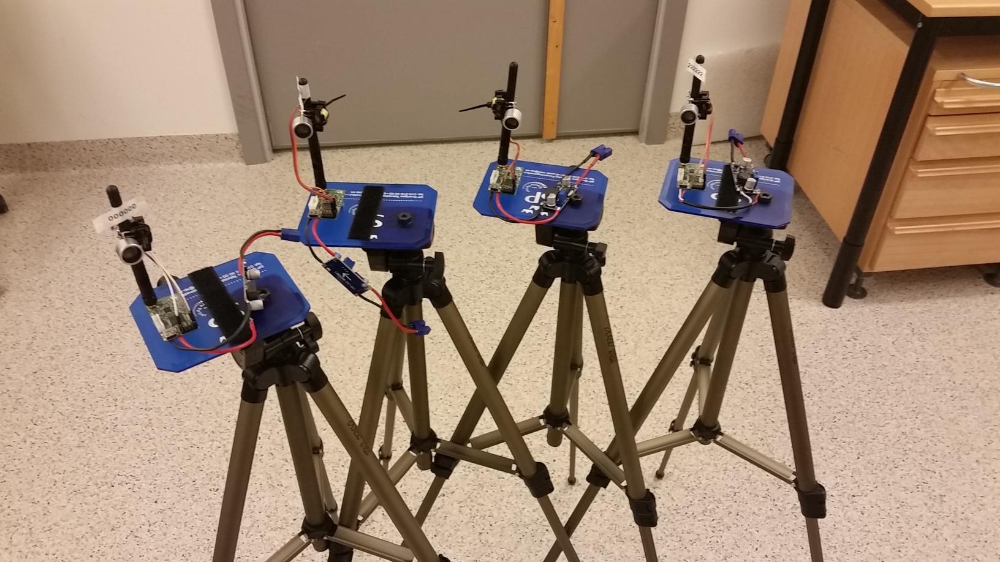

Figure 8 shows three quadcopters, three anchors and the distances measured between them. The quadcopters know the locations of all anchors, which are configured via [QuadcopterTool](#quadcoptertool).

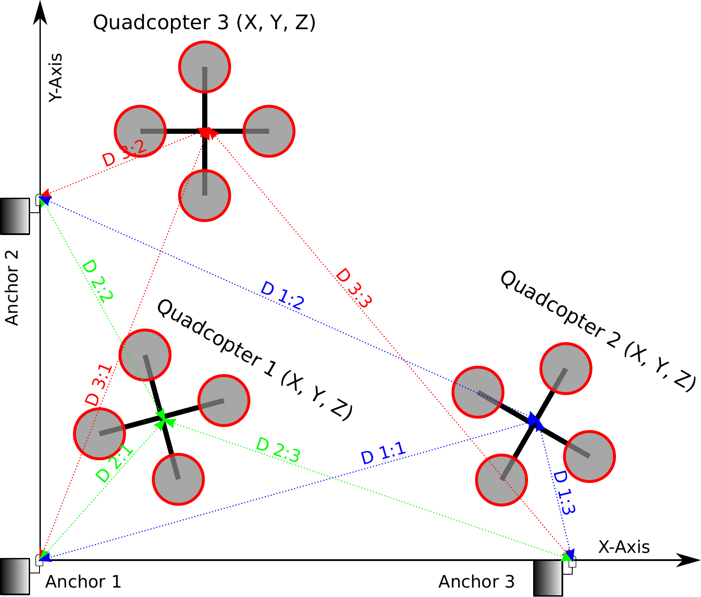

To reject noise, the ultrasound pulses are modulated sinc functions and the Ranging Board does cross correlation between the samples signal and the expected pulse shape. Figure 9 shows the raw sampled signal and the cross correlation result when measuring a distance of around 10m. It can be seen that the cross correlation rejects almost all noise until the actual pulse (and its reflections) is received. To get the direct path and not a reflection that might be stronger, the Ranging Boards looks for the first top above a certain threshold and not the highest top.

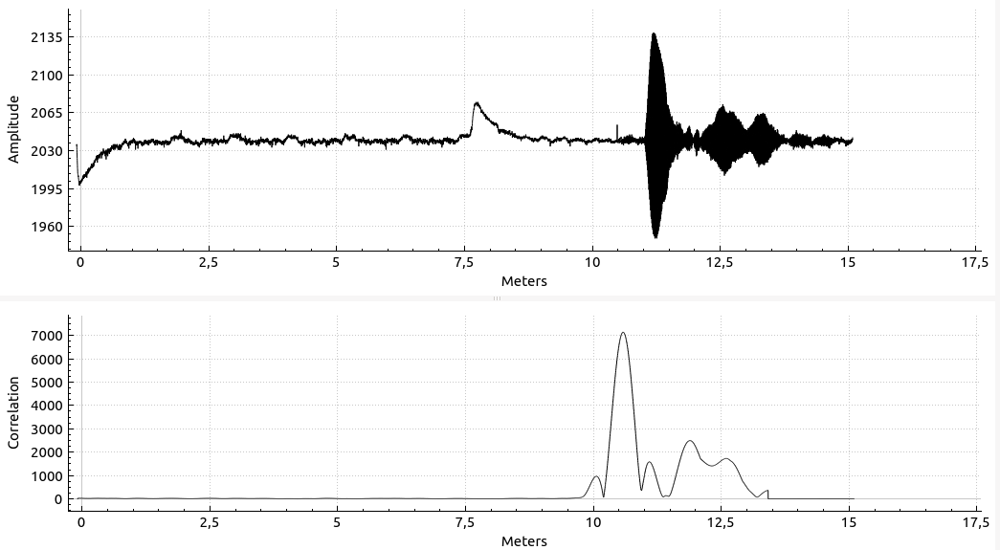

If no pulse above with an amplitude above the threshold is received, the measurement from that anchor is ignored. This way, the system can still operate when one or two anchors fail (if there are enough anchors from the beginning).

## CopterSim

CopterSim is a library written in C++ with an interface where quadcopters can be added, removed, or commanded to move. A block diagram of the simulator is shown in Figure 10.

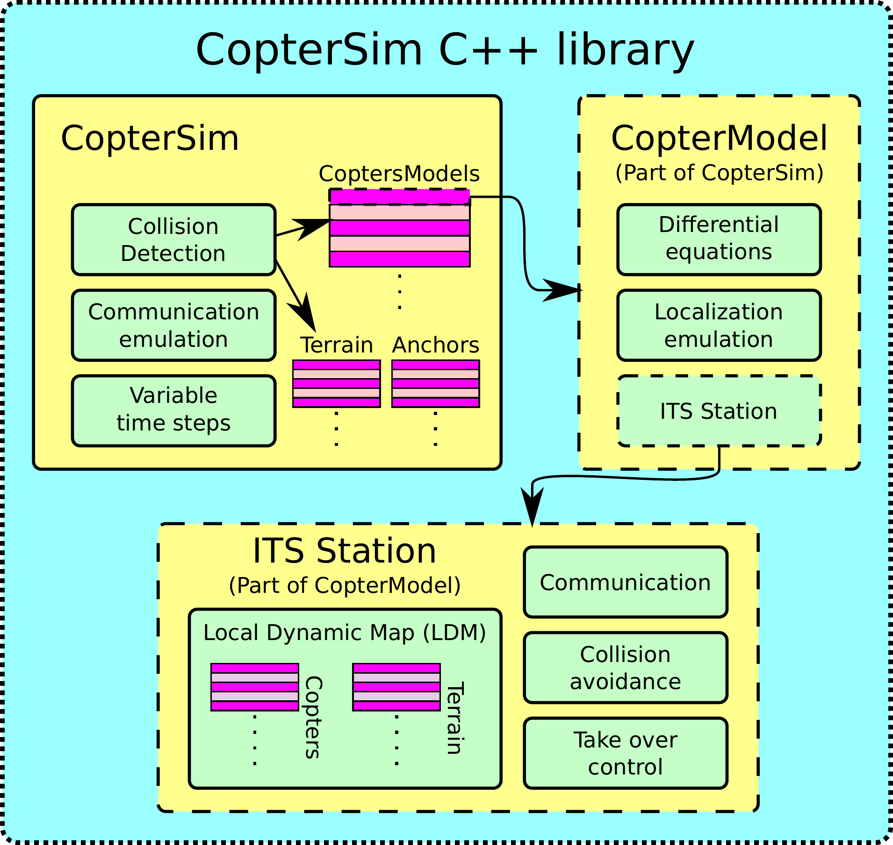

The block named *CopterSim* has a list of *CopterModels* and a list of line segments that represent static terrain. For every time-step dt, CopterSim executes the state update function for each CopterModel and checks for collisions between all CopterModels and the static terrain. When a collision occurs, the simulation is halted and the position of the collision is reported. When a CopterModel is added to the simulation, CopterSim will upload the list of terrain to it and broadcast perceived position state messages from it to the other CopterModels and vice versa. This broadcast is done between all quadcopters every communication time interval and the messages are passed through the communication channel of FaultCheck, where communication faults can be injected.

The *CopterModel* block runs the same source code for position and velocity estimation as the implementation on the embedded implementation. The attitude is updated from the movement command with a similar response to that of the actual hardware, and the golden run (the fault-free position and velocity state) is updated based on this attitude. In addition to the true position state for each quadcopter, CopterModel also updates the perceived position for them. For the perceived position, we have added FaultCheck probes to the various state variables where faults can be injected. As long as no fault is activated, the true and perceived position will be the same. As soon as we activate faults, the positions will drift apart.

In order to compensate for faults and thus position drift, the perceived position has to be estimated using ultrasound sensor readings. CopterModel is aware of all anchors and emulates ultrasound-sensor readings based on the true position state and the anchor positions, with the same rate as they are received on the hardware quadcopters. These readings are passed to the correction part of the position-estimation algorithm, which then corrects the position.

Every CopterModel has a block named ITS station, which builds and updates a Local Dynamic Map (LDM) that contains all other quadcopters and their states as it receives messages from them. The ITS station also keeps track of the terrain (received from CopterSim) and runs a collision-avoidance mechanism based on the LDM. Since the ITS-station operates on the perceived position of all quadcopters, it is important that the position-estimations algorithm performs well when there are faults present, and that safety margins are large enough to cope with an inaccurate perceived position.

### Collision Avoidance in the Simulator
We perform collision avoidance by placing risk contours around quadcopters and static objects from the perspective of every quadcopter, and steering away if the risk contours overlap with the comfort zone of the quadcopter. This means that the risk contours are not a global state, but different from every quadcopter's perspective based on its relative velocity to the object and when the positions of other quadcopters were last received. The comfort zone is represented as a circle placed around the quadcopter with a radius that is calculated based on the confidence of the position estimation.

The risk contours are two-dimensional and represented as ellipses with width, height and rotation, and they are sized and rotated based on the squared relative velocity vector to the quadcopters/objects they surround. To share knowledge about the position of all quadcopters, the quadcopters broadcast this information, one at a time, to the rest of the fleet. When a quadcopter receives a position update from another quadcopter, it will update its LDM, which contains the positions of all other known quadcopters and the surrounding terrain, with this information. Between the position updates, the risk contours around other quadcopters will be moved and reshaped based on the velocity that the other quadcopters had when their positions were last received. When an overlap between the comfort zone of a quadcopter and a risk contour occurs, the collision-avoidance mechanism will take over control and steer away from the overlapping risk contour in the opposing direction. If there are several overlaps at the same time, a vector will be calculated from a weighted sum of all overlapping risk contours and their relative direction, and used to steer away from the collision.

## CopterSimGui

CopterSimGui is a GUI for controlling the [CopterSim](#coptersim) library. It supports the interfaces of CopterSim and also has some hard coded scenarios. All simulated quadcopters are shown in a list together with their actual and perceived position. There is also an interface to control the probes of the FaultCheck library and do fault injection in the simulation. A screenshot of CopterSimGui is shown Figure 11.

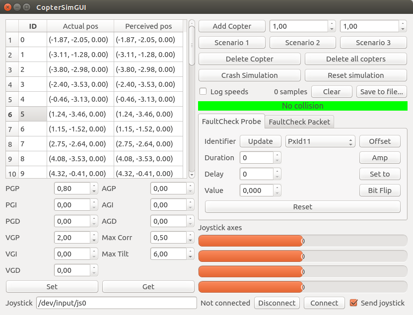

The connection between CopterSim, FaultCheck, CopterSimGui and QuadcopterTool is shown in Figure 12. CopterSimGui links to the CopterSim library, which links to the FaultCheck library. The CopterSim library sends the state of the simulation to QuadcopterTool over UDP so that the simulation can be visualized in real time using the same drawing interface as for the hardware quadcopters.

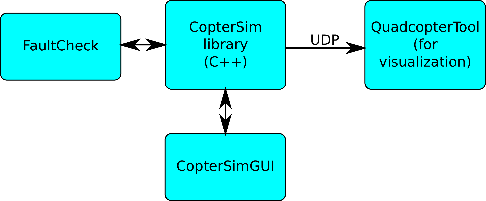

Figure 13 shows a screenshot of [QuadcopterTool](#quadcoptertool) where a CopterSim simulation with many quadcopters is visualized in real time. The quadcopter with the small circle around it (which is the comfort zone) is the selected one and the red circles are the risk contours around other quadcopters that overlap with the comfort zone of the selected quadcopter. All risk contours in that screenshot are from the perspective of the selected quadcopter.

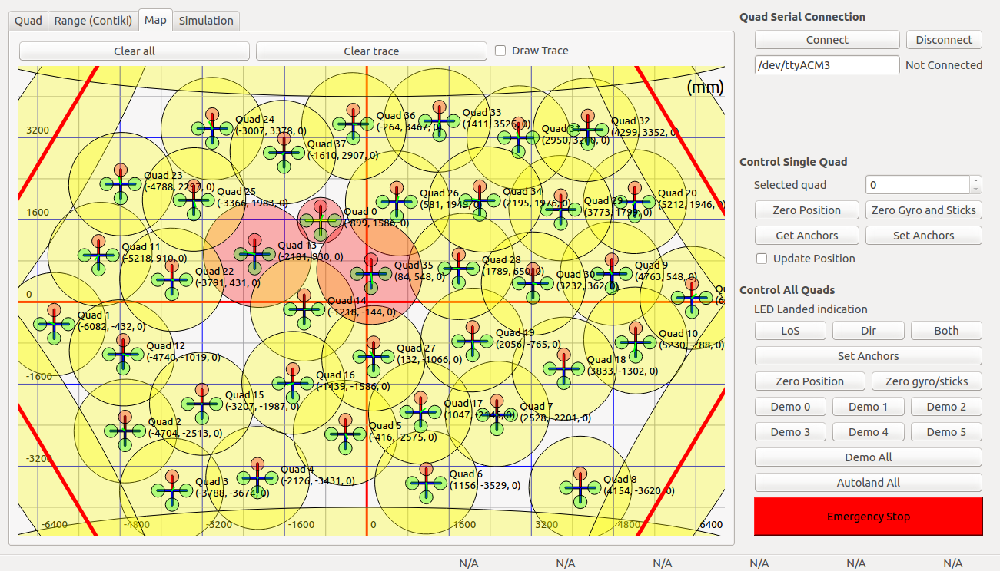

QuadcopterTool can also show the which faults are injected for different quadcopters and the position and velocity errors caused by these faults as shown in Figure 14.

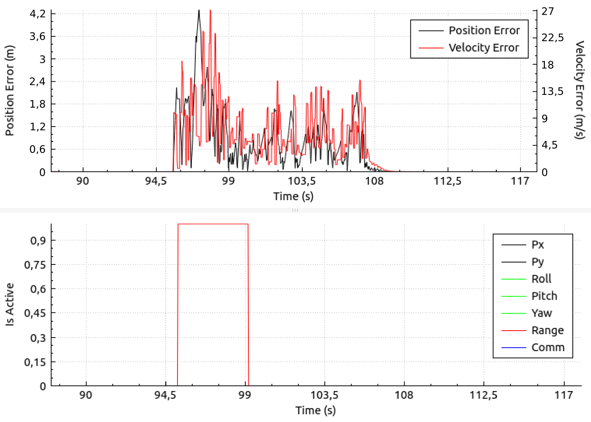

